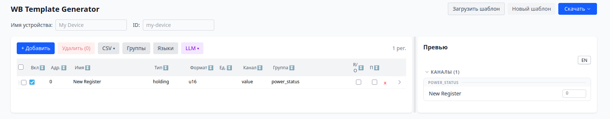
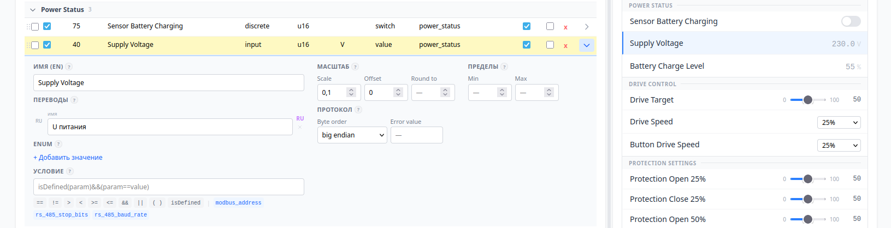

# WB Template Generator

Веб-сервис для создания и редактирования JSON-шаблонов Modbus-устройств для драйвера [wb-mqtt-serial](https://github.com/wirenboard/wb-mqtt-serial) (Wiren Board).

## Возможности

- **Автоматическая генерация через LLM** — загрузите документацию устройства (PDF, Excel, изображение с таблицей регистров), и LLM извлечёт все Modbus-регистры, определит типы каналов, параметры, единицы измерения и enum-значения
- **Создание шаблона вручную** — добавляйте регистры по одному через визуальный редактор: адрес, тип, формат, масштаб, группа, enum и другие свойства
- **Импорт существующих шаблонов** — загрузите готовый `.json` или `.json.jinja` шаблон wb-mqtt-serial для редактирования и доработки
- **Визуальный редактор** — таблица регистров с inline-редактированием, drag-n-drop сортировкой, группировкой, CSV импортом/экспортом
- **Превью шаблона** — интерактивное превью справа показывает как устройство будет выглядеть в интерфейсе Wiren Board (каналы, параметры, переключатели, слайдеры)
- **Мультиязычность** — переводы названий каналов и enum-значений на любые языки, автоперевод через LLM
- **Экспорт** — скачивание готового `.json` шаблона или `.json.jinja` (с автоматическим обнаружением повторяющихся паттернов и сворачиванием в `` циклы)

## Скриншоты

### Пустой интерфейс


### Анализ документа через LLM


### Таблица регистров с превью шаблона


## Быстрый старт

```bash
cp env.example .env
# Отредактируйте .env — укажите LLM_API_KEY и LLM_API_URL

docker compose up --build -d
# Откройте http://localhost:9080
```

## Как это работает

1. Загрузите PDF / Excel / изображение с таблицей Modbus-регистров
2. Выберите тип шаблона (Small / Medium / Full)
3. LLM проанализирует документ и извлечёт регистры
4. Доработайте результат в визуальном редакторе
5. Скачайте готовый `.json` или `.json.jinja` шаблон

### Типы шаблонов

| Тип | Описание |
|-----|----------|
| **Small** | 10-30 основных каналов для измерений и управления |
| **Medium** | Каналы + параметры конфигурации устройства |
| **Full** | Все регистры устройства без фильтрации |

## Архитектура

```
                ┌─────────┐     ┌─────────┐     ┌─────────────┐
 Браузер ──────>│  nginx  │────>│ FastAPI  │────>│ OpenAI API  │
                │ :9080   │     │ :9000    │     │ (любой LLM) │
                └─────────┘     └─────────┘     └─────────────┘
                 frontend        backend
```

- **Frontend**: React 18 + TypeScript + Vite + Zustand + Tailwind CSS v4
- **Backend**: Python 3.12 + FastAPI + uvicorn
- **LLM**: Любой OpenAI-совместимый API (OpenAI, Anthropic, локальный)
- **PDF**: pdfplumber + pdf2image + Pillow
- **Excel**: openpyxl
- **Контейнеризация**: Docker Compose (nginx + uvicorn)

## Структура проекта

```
backend/
  main.py              # FastAPI: эндпоинты, middleware, очереди, rate limiting
  config.py            # Настройки из .env (pydantic-settings)
  models.py            # Pydantic-модели (Register, BuildRequest и т.д.)
  llm_service.py       # LLM-интеграция: анализ документов, батчинг PDF
  template_builder.py  # Детерминированная сборка JSON-шаблона
  template_importer.py # Импорт существующих .json/.json.jinja шаблонов
  jinja_exporter.py    # Экспорт в .json.jinja с детекцией for-паттернов
  file_converter.py    # PDF -> images, Excel -> text, Image -> base64
  prompts.py           # Системные промпты для LLM
  sse.py               # SSE-события (progress, result, done, error)
  request_context.py   # ContextVar для request_id (трейсинг)
  queue_manager.py     # In-memory очередь на asyncio.Event
  mock_data.py         # Mock-данные для разработки без LLM
  pyproject.toml       # Конфиг ruff, mypy, pytest
  tests/               # pytest-тесты + фикстуры

frontend/src/
  App.tsx              # Главный компонент (редактор)
  api.ts               # API-клиент (SSE, REST)
  store.ts             # Zustand store — всё состояние приложения
  types.ts             # TypeScript типы
  constants.ts         # Форматы, единицы, языки
  components/          # UI-компоненты редактора

.github/workflows/
  push_other.yml       # ветки/PR: lint + test + проверка CHANGELOG
  push_master.yml      # main: проверки → сборка образов по git-SHA → выкат → smoke → журнал → тег
  rollback.yml         # кнопка отката (workflow_dispatch)
.github/actions/
  deploy/              # composite-действие выката (scp + ssh через готовые actions)

ci/
  README.md            # как устроен конвейер
  shell/               # smoke-проверка и сторож свежести

Makefile               # единый запускатор: make lint / test / build / smoke
DEPLOYING.md           # операторская карточка: как выкатить, откатить, что делать при аварии
docker-compose.deploy.yml  # прод: образы по git-SHA из реестра (без сборки на сервере)
```

## API

| Метод | Путь | Описание |
|-------|------|----------|
| POST | `/api/analyze` | SSE — анализ документа через LLM |
| POST | `/api/cancel-analyze` | Отмена запроса в очереди |
| POST | `/api/build` | Сборка JSON-шаблона из регистров |
| POST | `/api/build-jinja` | Сборка Jinja-шаблона (.json.jinja) |
| POST | `/api/import-template` | Импорт .json / .json.jinja |
| POST | `/api/translate` | Перевод строк через LLM |
| POST | `/api/models` | Список моделей LLM API |
| GET | `/api/status` | Статус сервера (LLM, лимиты) |
| GET | `/api/health` | Healthcheck (uptime, очереди) |
| GET | `/api/queue-status` | Состояние очередей |
| GET | `/api/metrics` | Метрики (счётчики, гистограммы) |

### SSE-события `/api/analyze`

```
event: progress  ->  {stage, message, current?, total?, request_id, queue_position?, queue_eta?}
event: result    ->  {request_id, device_info, registers}
event: done      ->  {message, request_id}
event: error     ->  {message, request_id}
```

Стадии прогресса: `queued` -> `uploading` -> `converting` -> `analyzing` -> `slow` -> `merging` -> done/error.

Стадия `slow` — мягкий таймаут (по умолчанию 3 мин), анализ продолжается, но пользователю предлагается подождать или отменить.

## Настройки

Все настройки через переменные окружения (`.env`). См. `env.example`.

### LLM

| Переменная | По умолчанию | Описание |
|------------|-------------|----------|
| `LLM_API_URL` | _(пусто)_ | URL OpenAI-совместимого API. Пусто = mock-режим |
| `LLM_API_KEY` | _(пусто)_ | API-ключ |
| `LLM_MODEL` | `gpt-5.6-luna` | Модель (`gpt-5.4-mini` — ещё дешевле, `gpt-5.5` — дороже, качество то же) |
| `LLM_MAX_TOKENS` | `0` | 0 = без ограничения, >0 = лимит токенов |
| `LLM_LEGACY_MAX_TOKENS` | `false` | `true` = `max_tokens` (старые API), `false` = `max_completion_tokens` |
| `LLM_TIMEOUT` | `600` | Жёсткий таймаут HTTP-запроса к LLM (сек) |
| `LLM_SOFT_TIMEOUT` | `180` | Мягкий таймаут — предложить продлить (сек) |
| `LLM_TEMPERATURE` | _(пусто)_ | Пусто = дефолт модели (нужно для gpt-5.x); 0 = детерминизм для gpt-4o/локальных |
| `LLM_PROXY` | _(пусто)_ | HTTP/SOCKS5 прокси для запросов к LLM API |
| `PDF_BATCH_SIZE` | `0` | Страниц на батч (0 = все одним запросом) |
| `MAX_FILE_SIZE_MB` | `1` | Максимальный размер загружаемого файла (МБ) |

### Очереди и лимиты

| Переменная | По умолчанию | Описание |
|------------|-------------|----------|
| `QUEUE_SERVER_MAX_CONCURRENT` | `15` | Параллельных запросов к серверному LLM |
| `QUEUE_CUSTOM_MAX_CONCURRENT` | `15` | Параллельных запросов с пользовательским LLM |
| `QUEUE_ACTIVATION_DELAY` | `1.0` | Задержка между запусками из очереди (сек) |
| `RATE_LIMIT_REQUESTS` | `10` | Запросов за окно |
| `RATE_LIMIT_WINDOW` | `60` | Окно rate limit (сек) |

### Сервер

| Переменная | По умолчанию | Описание |
|------------|-------------|----------|
| `CORS_ORIGINS` | `*` | Разрешённые origins через запятую |
| `LOG_FORMAT` | `text` | Формат логов: `text` (dev) или `json` (prod) |

## Продакшен-инфраструктура

- **Request ID**: каждый запрос получает 8-символьный hex ID, который пробрасывается через SSE, логи и заголовок `X-Request-Id`
- **Очереди**: in-memory на `asyncio.Event`, раздельные для серверного и пользовательского LLM, с задержкой между активациями
- **Rate limiter**: sliding window по IP
- **Изоляция LLM**: при серверном LLM пользовательский system_prompt игнорируется
- **Мягкий таймаут**: через 3 мин анализа пользователю предлагается продолжить или отменить
- **SSE keepalive**: каждые 15 сек отправляется прогресс с таймером, чтобы nginx не убивал соединение
- **Метрики**: in-memory счётчики и гистограммы в `/api/metrics`
- **Security headers**: `X-Content-Type-Options`, `X-Frame-Options`, `Content-Security-Policy`, `Referrer-Policy` (в prod nginx)
- **JSON-логи**: `LOG_FORMAT=json` включает структурированные логи с таймингами операций
- **CORS**: параметризован через `CORS_ORIGINS` — `*` для dev, конкретные origins для prod
- **Валидация файлов**: проверка MIME-типа и расширения загружаемых файлов (pdf, xlsx, png, jpg, jpeg, webp)

### Продакшен-деплой

Выкат автоматический и **сборки на сервере нет**: образы собираются в CI и помечаются
git-SHA, сервер только скачивает готовый образ. Поэтому любую версию можно вернуть за
секунды — она уже лежит в реестре.

- Смержил PR в `main` → `push_master` сам собирает, выкатывает, гоняет smoke и пишет в журнал.
- Откат — **Actions → rollback → Run workflow** (пустой `target` = предыдущая успешная версия).
- Пошагово, включая аварийные сценарии и break-glass, — в [`DEPLOYING.md`](DEPLOYING.md).
- Что сейчас в проде: **Environments → production** или `/api/status` (поле `revision`).

Прод-конфигурация — [`docker-compose.deploy.yml`](docker-compose.deploy.yml): образы по
git-SHA из `ghcr.io`, bridge-сеть, `restart: always`, healthcheck-зависимость frontend от
backend. Секреты (`DEPLOY_HOST`, `DEPLOY_DIR`, `PROD_URL`, `DEPLOY_SSH_KEY`) живут в среде
`production`, `.env` с ключами — на сервере, в репозиторий не попадает.

**Два compose-файла — разные задачи:**

| Файл | Где используется | Как получает код |
|---|---|---|
| `docker-compose.yml` | локальная разработка (`make up`) | собирает образы из исходников тут же, host networking, порты 9080/9000 |
| `docker-compose.deploy.yml` | боевой сервер (использует CI) | скачивает готовый образ по git-SHA из `ghcr.io`, bridge-сеть, публикует `${WEB_PORT:-80}` |

## Разработка

```bash
# Dev-режим (host networking, hot reload)
docker compose up --build -d

# Frontend: http://localhost:9080
# Backend:  http://localhost:9000

# Тесты
docker compose exec backend pytest tests/ -v

# Тесты с покрытием
docker compose exec backend pytest tests/ -v --cov=. --cov-report=term

# Линтинг
docker compose exec backend ruff check .

# Проверка типов
docker compose exec backend mypy models.py template_builder.py jinja_exporter.py

# Пересборка без кеша (при изменении зависимостей)
docker compose build --no-cache && docker compose up -d

# Логи
docker compose logs -f backend
```

### Mock-режим

Если `LLM_API_URL` не задан — backend работает в mock-режиме с тестовыми данными SDM-230. Удобно для разработки фронтенда без реального LLM.

### CI/CD

Один вход для всех проверок — `make`: те же команды локально и в CI, разницы «у меня
работало» нет.

```bash
make lint      # ruff + mypy, eslint + tsc, shellcheck + bash -n
make test      # pytest --cov (порог 70%) + vitest
```

| Workflow | Когда | Что делает |
|---|---|---|
| `push_other.yml` | ветки и PR в `main` | `make lint`, `make test`, CHANGELOG обновлён и `[Unreleased]` пуста |
| `push_master.yml` | push в `main` | проверки → сторож свежести → сборка+пуш образов по git-SHA → выкат → smoke → журнал → git-тег из CHANGELOG |
| `rollback.yml` | кнопка (workflow_dispatch) | откат на версию из журнала или на указанный SHA |

Работу с реестром, сервером и журналом делают готовые действия
(`docker/build-push-action`, `appleboy/scp-action` + `appleboy/ssh-action`,
`bobheadxi/deployments`, `dangoslen/changelog-enforcer`); шаги выката собраны в
локальном composite-действии `.github/actions/deploy`. Свои скрипты остались только
там, где готового действия нет: `ci/shell/`.

## Формат шаблона wb-mqtt-serial

Генерируемые шаблоны соответствуют формату [wb-mqtt-serial](https://github.com/wirenboard/wb-mqtt-serial).

Допустимые значения полей:

- **type**: value, switch, pushbutton, range, text, rgb, wo-switch, temperature, voltage, current, power, ...
- **format**: u16, s16, u32, s32, u64, float, string
- **reg_type**: holding, input, coil, discrete
- **units**: V, A, deg C, %, RH, Ohm, bar, ppm, W, kWh, ...

### Jinja-экспорт

При экспорте в `.json.jinja` автоматически обнаруживаются повторяющиеся структуры и сворачиваются в `` циклы:

- **Числовые паттерны** — каналы с числом в имени ("Input 1"..."Input 8") и арифметической прогрессией адресов
- **Строковые паттерны** — каналы с одинаковой структурой, различающиеся одним словом ("Button Single Press", "Button Long Press") → ``
- **Вариантные каналы** — каналы с одинаковым именем но разными sporadic/condition → вложенный `` по вариантам
- **Переводы** — повторяющиеся ключи в секции translations сворачиваются в циклы
- **Шаблонизируемые поля** — group, condition с варьирующимся номером заменяются на `{{ i }}`

Минимум 2 элемента для обнаружения паттерна. Числовые паттерны имеют приоритет над строковыми.
